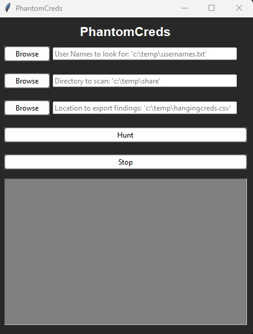

# PhantomCreds


Hunt down hidden credentials across file shares — quickly, quietly, and effectively.

# Purpose

Credential sprawl is a real threat in enterprise environments. Stray usernames and passwords left in forgotten .txt, .log, or .csv files can expose your organization to unnecessary risk. Whether you’re doing incident response, red team training, or hardening file shares, **PhantomCreds** helps you find the ghosts in your network.

PhantomCreds is a lightweight GUI tool that scans file shares for files containing usernames, patterns that resemble passwords, and suspicious filenames. With a clean interface and exportable results, it's perfect for both security professionals and sysadmins.

# Features

- Dark-themed GUI for comfortable use
- Scans files for:
  - Matching usernames from a provided list
  - Patterns resembling strong passwords
    - 12-26 characters, with 1 uppercase, 1 lowercase, 1 number, and 1 symbol.
  - Suspicious filenames (like `user.txt`, `passwords.csv`, etc.)
- Exports results to `.csv`
- Displays file metadata like:
  - Creation date
  - File owner
  - Match type (filename, username, password)
- Supports `.txt`, `.csv`, `.log`, `.conf`, and `.ini` files

# How to Use

1. **Download PhantomCreds.exe** or run the script with `pythonw` to avoid console windows.
2. Launch the GUI:
   - `Usernames File`: A `.txt` file containing usernames (one per line).
   - `Directory to Scan`: The folder (and subfolders) PhantomCreds will recursively search.
   - `Output File`: Where you want the results exported (`.csv`).

3. Click **Hunt** and let PhantomCreds do its thing.
  - The UI will display total files scanned every 5 seconds.

4. Review results in the message panel or check the exported `.csv` file.
    - The total number of scanned files will display at the bottom of the message block when complete.


   ### Exporting All Active Directory Users

      1. Login to a domain joined workstation with an account that has access to Active Directory.

      2. Run the following script in powershell
        - change  ```"$outputFile = "C:\Temp\useraccounts.txt"``` to the location you want to save the information to.

``` # Import AD module (required if not running from AD PowerShell)
Import-Module ActiveDirectory

# Set the output file path
$outputFile = "C:\Temp\useraccounts.txt"

# Get all users from the domain and select sAMAccountName
Get-ADUser -Filter * -Properties sAMAccountName | 
    Select-Object -ExpandProperty sAMAccountName |
    Sort-Object |
    Out-File -FilePath $outputFile -Encoding UTF8

Write-Output "sAMAccountNames saved to $outputFile"
```


### Example UI:



---

# Build Notes

This project is designed to be **stealthy**, **lightweight**, and **customizable**.


# Support 

This repository is currently maintained by a single IT. Please consider sponsoring 404Staging to help maintain this project and others.

